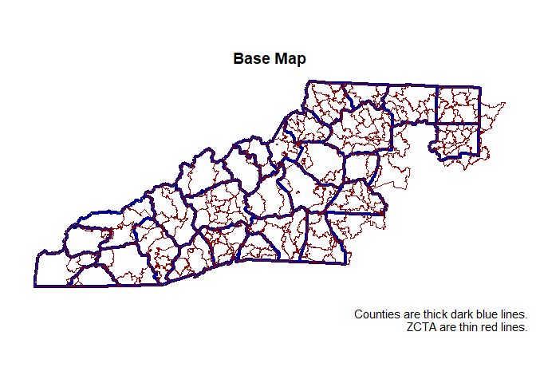
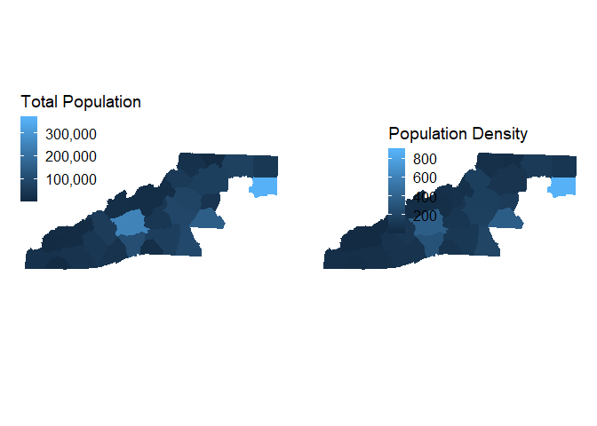

Packages
--------

One of the best packages for pulling census data is `tidycensus`. Other
useful packages include `here` for file directory support, `tidyverse`
for data manipulation, and `ggplot` for graphs.

    library(here)
    library(tidyverse)

    library(tidycensus)
    options(tigris_use_cache = TRUE)

    library(scales)
    library(leaflet)
    library(cowplot)
    library(units)
    library(sf)

Setup
-----

The following code sets up a blank theme so the maps look better and
pulls in the county list to limit the data collection to western North
Carolina. You can view the list of in the csv listed above this
tutorial.

    ## Null Theme
    theme_null <- function() {
      theme(axis.title=element_blank(),
            axis.text=element_blank(),
            axis.ticks=element_blank(),
            axis.line = element_blank(),
            panel.background = element_blank(),
            panel.border = element_blank(),
            panel.grid.major = element_line(colour = 'transparent'),
            panel.grid.minor = element_blank())
    }

    counties <- read.csv(here::here("census", "Access", "R", "nc_counties.csv"))
    counties <- counties %>% filter(WNC == 1)

Census API key
--------------

You'll need to get your own API key. This can be obtained
[here](https://api.census.gov/data/key_signup.html).

    # census_api_key("KEY GOES HERE", install = TRUE)
    # Explain this better

See variables
-------------

Here are all the available variables.

    acs_vars <- load_variables(2016, "acs5", cache = TRUE)

    get_vars <- data.frame( name = c(
      "B01003_001E", # Total Population
      
      "B02001_001E", # Race/Ethnicity
      "B03002_003E",
      "B03002_004E",
      "B03002_005E",
      "B03002_006E",
      "B03002_007E",
      "B03002_008E",
      "B03002_010E",
      "B03002_011E",
      "B03002_012E"))

    get_vars <- get_vars %>%
      left_join(acs_vars, by = "name")

    ## Warning: Column `name` joining factor and character vector, coercing into
    ## character vector

    # Clean up
    get_vars$label <- gsub("Estimate|!|,|\\$", "", get_vars$label)
    get_vars$label <- ifelse(get_vars$label != "Total", gsub("Total", "", get_vars$label), get_vars$label)
    get_vars$label <- gsub("\\(([^\\)]+)\\)||Civilian labor force", "", get_vars$label)
    get_vars$concept <- gsub("\\(([^\\)]+)\\)", "", get_vars$concept)
    get_vars$label <- tolower(get_vars$label)
    get_vars$concept <- tolower(get_vars$concept)
    get_vars$label <- gsub(" ", "_", get_vars$label)
    get_vars$concept <- gsub(" ", "_", get_vars$concept)
    get_vars$label <- paste(get_vars$concept, get_vars$label, sep = "_")
    get_vars$concept <- NULL

    get_vars

    ##           name label
    ## 1  B01003_001E NA_NA
    ## 2  B02001_001E NA_NA
    ## 3  B03002_003E NA_NA
    ## 4  B03002_004E NA_NA
    ## 5  B03002_005E NA_NA
    ## 6  B03002_006E NA_NA
    ## 7  B03002_007E NA_NA
    ## 8  B03002_008E NA_NA
    ## 9  B03002_010E NA_NA
    ## 10 B03002_011E NA_NA
    ## 11 B03002_012E NA_NA

Pull data
---------

The following code pulls the data from the census. For North Carolina,
the the STATE value is 37. The zcta\_county\_rel\_10.txt file came from
the census website
[here](https://www.census.gov/geo/maps-data/data/zcta_rel_layout.html).
More information about zip code tabulation area can be found
[here](https://www.census.gov/geo/reference/zctas.html).

    ## ZCTA
    # Close to Zip Code
    zcta_county_match <- read.table(here::here("census", "Access", "R", "zcta_county_rel_10.txt"), # Get this file from census website
                                    header = TRUE, sep = ",")

    zcta_county_match <- zcta_county_match[zcta_county_match$STATE == 37 &
                                             zcta_county_match$COUNTY %in% counties$COUNTYFP, ]

    wnc_zcta_data <- get_acs(geography = "zip code tabulation area",
                                   variables = get_vars$name,
                                   geometry = TRUE,
                                   output = "wide")
    wnc_zcta_data <- wnc_zcta_data[wnc_zcta_data$GEOID %in% zcta_county_match$ZCTA5,
                                               names(wnc_zcta_data) %in% c("NAME", "GEOID", "geometry", get_vars$name)]

    ## Counties
    wnc_county_data <- reduce(
      map(counties$COUNTY, function(x) {
        get_acs(geography = "county", variables = get_vars$name,
                state = "NC", county = x, geometry = TRUE, output = "wide")
      }),
      rbind
    )

    wnc_county_data <- wnc_county_data[, names(wnc_county_data) %in% c("NAME", "GEOID", "geometry", get_vars$name)]

    ### Investigate

    # Base Maps
    ggplot() +
      geom_sf(data = wnc_county_data, col = "darkblue", fill = NA, lwd = 1.5) +
      geom_sf(data = wnc_zcta_data, col = "darkred", fill = NA) +
      ggtitle("Base Map") +
      theme_null() +
      labs(caption = "Counties are thick dark blue lines.\nZCTA are thin red lines.")

    ## Total Population
    # Add in Density
    wnc_county_data <- wnc_county_data %>%
      mutate(area = as.numeric(set_units(st_area(geometry), mi^2)),
      density = as.numeric(B01003_001E / set_units(st_area(geometry), mi^2)))

    wnc_zcta_data <- wnc_zcta_data %>%
      mutate(area = as.numeric(set_units(st_area(geometry), mi^2)),
             density = as.numeric(B01003_001E / set_units(st_area(geometry), mi^2)))

    # County
    county_1 <- ggplot() +
      geom_sf(data = wnc_county_data, aes(col = B01003_001E, fill = B01003_001E)) +
      scale_color_continuous(name = "Total Population",
                             labels = comma) +
      scale_fill_continuous(name = "Total Population",
                            labels = comma) +
      theme(legend.position = c(0, 1)) +
      theme_null()

    county_2 <- ggplot() +
      geom_sf(data = wnc_county_data, aes(col = density, fill = density)) +
      scale_color_continuous(name = "Population Density",
                             labels = comma) +
      scale_fill_continuous(name = "Population Density",
                            labels = comma) +
      theme(legend.position = c(.25, .75)) +
      theme_null()

    plot_grid(county_1, county_2)

    zcta_1 <- ggplot() +
      geom_sf(data = wnc_zcta_data, aes(col = B01003_001E, fill = B01003_001E)) +
      scale_color_continuous(name = "Total Population",
                             labels = comma) +
      scale_fill_continuous(name = "Total Population",
                            labels = comma) +
      theme(legend.position = c(0, 1)) +
      theme_null()

    zcta_2 <- ggplot() +
      geom_sf(data = wnc_zcta_data, aes(col = density, fill = density)) +
      scale_color_continuous(name = "Population Density",                         
                             labels = comma) +  
      scale_fill_continuous(name = "Population Density",
                            labels = comma) +  
      theme(legend.position = c(0, 1)) +  
      theme_null()

    plot_grid(zcta_1, zcta_2)

