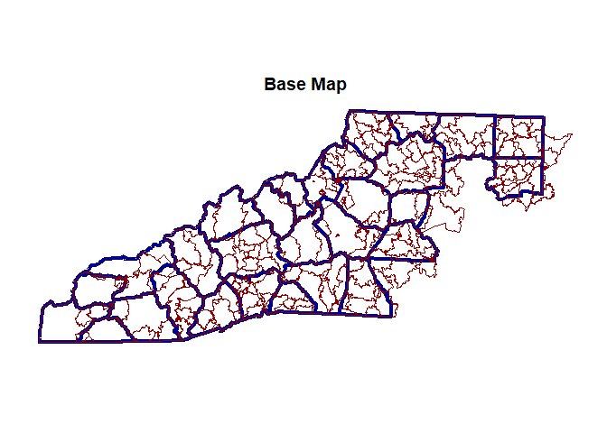
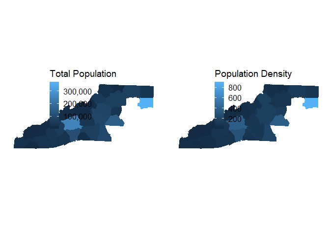
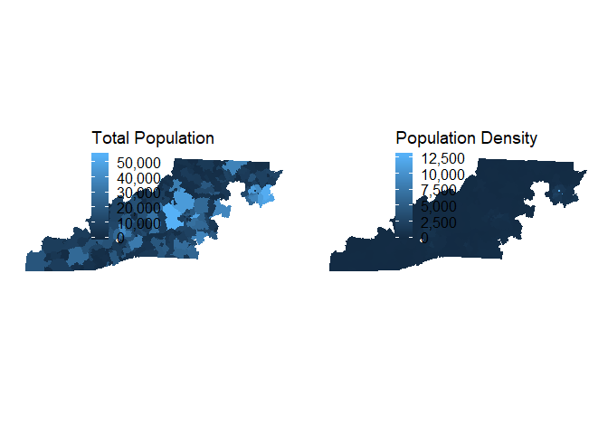

Packages
--------

One of the best packages for pulling census data is `tidycensus`. Other
useful packages include `here` for file directory support, `tidyverse`
for data manipulation, and `ggplot` for graphs.

    library(here)

    ## here() starts at C:/Users/wtbra/Documents/github_repos/Asheville-Community-Data-Library

    library(tidyverse)

    ## -- Attaching packages --------------------------------------------------------- tidyverse 1.2.1 --

    ## v ggplot2 3.0.0     v purrr   0.2.5
    ## v tibble  1.4.2     v dplyr   0.7.6
    ## v tidyr   0.8.1     v stringr 1.3.1
    ## v readr   1.1.1     v forcats 0.3.0

    ## -- Conflicts ------------------------------------------------------------ tidyverse_conflicts() --
    ## x dplyr::filter() masks stats::filter()
    ## x dplyr::lag()    masks stats::lag()

    library(tidycensus)
    options(tigris_use_cache = TRUE)

    library(scales)

    ## 
    ## Attaching package: 'scales'

    ## The following object is masked from 'package:purrr':
    ## 
    ##     discard

    ## The following object is masked from 'package:readr':
    ## 
    ##     col_factor

    library(leaflet)
    library(cowplot)

    ## 
    ## Attaching package: 'cowplot'

    ## The following object is masked from 'package:ggplot2':
    ## 
    ##     ggsave

    library(units)

    ## udunits system database from C:/Users/wtbra/Documents/R/win-library/3.5/units/share/udunits

    library(sf)

    ## Linking to GEOS 3.6.1, GDAL 2.2.3, proj.4 4.9.3

Setup
-----

The following code sets up a blank theme so the maps look better and
pulls in the county list to limit the data collection to western North
Carolina.

    ## Null Theme
    theme_null <- function() {
      theme(axis.title=element_blank(),
            axis.text=element_blank(),
            axis.ticks=element_blank(),
            axis.line = element_blank(),
            panel.background = element_blank(),
            panel.border = element_blank(),
            panel.grid.major = element_line(colour = 'transparent'),
            panel.grid.minor = element_blank())
    }

    counties <- read.csv(here::here("census", "Access", "R", "nc_counties.csv"))
    counties <- counties %>% filter(WNC == 1)

Census API key
--------------

You'll need to get your own API key. This can be obtained
[here](https://api.census.gov/data/key_signup.html).

    # census_api_key("KEY GOES HERE", install = TRUE)
    # Explain this better

See variables
-------------

Here are all the available variables.

    acs_vars <- load_variables(2016, "acs5", cache = TRUE)

    get_vars <- data.frame( name = c(
      "B01003_001E", # Total Population
      
      "B02001_001E", # Race/Ethnicity
      "B03002_003E",
      "B03002_004E",
      "B03002_005E",
      "B03002_006E",
      "B03002_007E",
      "B03002_008E",
      "B03002_010E",
      "B03002_011E",
      "B03002_012E"))

    get_vars <- get_vars %>%
      left_join(acs_vars, by = "name")

    ## Warning: Column `name` joining factor and character vector, coercing into
    ## character vector

    # Clean up
    get_vars$label <- gsub("Estimate|!|,|\\$", "", get_vars$label)
    get_vars$label <- ifelse(get_vars$label != "Total", gsub("Total", "", get_vars$label), get_vars$label)
    get_vars$label <- gsub("\\(([^\\)]+)\\)||Civilian labor force", "", get_vars$label)
    get_vars$concept <- gsub("\\(([^\\)]+)\\)", "", get_vars$concept)
    get_vars$label <- tolower(get_vars$label)
    get_vars$concept <- tolower(get_vars$concept)
    get_vars$label <- gsub(" ", "_", get_vars$label)
    get_vars$concept <- gsub(" ", "_", get_vars$concept)
    get_vars$label <- paste(get_vars$concept, get_vars$label, sep = "_")
    get_vars$concept <- NULL

    ## ZCTA
    # Close to Zip Code
    zcta_county_match <- read.table(here::here("census", "Access", "R", "zcta_county_rel_10.txt"), # Get this file from census website
                                    header = TRUE, sep = ",")

    zcta_county_match <- zcta_county_match[zcta_county_match$STATE == 37 &
                                             zcta_county_match$COUNTY %in% counties$COUNTYFP, ]

    start_time <- Sys.time()
    wnc_zcta_data <- get_acs(geography = "zip code tabulation area",
                                   variables = get_vars$name,
                                   geometry = TRUE,
                                   output = "wide")

    ## Getting data from the 2012-2016 5-year ACS

    Sys.time() - start_time

    ## Time difference of 27.5495 secs

    # 2 mins

    wnc_zcta_data <- wnc_zcta_data[wnc_zcta_data$GEOID %in% zcta_county_match$ZCTA5,
                                               names(wnc_zcta_data) %in% c("NAME", "GEOID", "geometry", get_vars$name)]

    ## Counties
    wnc_county_data <- reduce(
      map(counties$COUNTY, function(x) {
        get_acs(geography = "county", variables = get_vars$name,
                state = "NC", county = x, geometry = TRUE, output = "wide")
      }),
      rbind
    )

    ## Getting data from the 2012-2016 5-year ACS
    ## Getting data from the 2012-2016 5-year ACS
    ## Getting data from the 2012-2016 5-year ACS
    ## Getting data from the 2012-2016 5-year ACS
    ## Getting data from the 2012-2016 5-year ACS
    ## Getting data from the 2012-2016 5-year ACS
    ## Getting data from the 2012-2016 5-year ACS
    ## Getting data from the 2012-2016 5-year ACS
    ## Getting data from the 2012-2016 5-year ACS
    ## Getting data from the 2012-2016 5-year ACS
    ## Getting data from the 2012-2016 5-year ACS
    ## Getting data from the 2012-2016 5-year ACS
    ## Getting data from the 2012-2016 5-year ACS
    ## Getting data from the 2012-2016 5-year ACS
    ## Getting data from the 2012-2016 5-year ACS
    ## Getting data from the 2012-2016 5-year ACS
    ## Getting data from the 2012-2016 5-year ACS
    ## Getting data from the 2012-2016 5-year ACS
    ## Getting data from the 2012-2016 5-year ACS
    ## Getting data from the 2012-2016 5-year ACS
    ## Getting data from the 2012-2016 5-year ACS
    ## Getting data from the 2012-2016 5-year ACS
    ## Getting data from the 2012-2016 5-year ACS
    ## Getting data from the 2012-2016 5-year ACS
    ## Getting data from the 2012-2016 5-year ACS
    ## Getting data from the 2012-2016 5-year ACS
    ## Getting data from the 2012-2016 5-year ACS
    ## Getting data from the 2012-2016 5-year ACS
    ## Getting data from the 2012-2016 5-year ACS

    wnc_county_data <- wnc_county_data[, names(wnc_county_data) %in% c("NAME", "GEOID", "geometry", get_vars$name)]

    ### Investigate

    # Base Maps
    ggplot() +
      geom_sf(data = wnc_county_data, col = "darkblue", fill = NA, lwd = 1.5) +
      geom_sf(data = wnc_zcta_data, col = "darkred", fill = NA) +
      ggtitle("Base Map") +
      theme_null()

    # leaflet() %>%
    #   addProviderTiles(provider = "CartoDB.Positron") %>%
    #   addPolygons(data = wnc_county_data,
    #               popup = ~ str_extract(NAME, "^([^,]*)"),
    #               stroke = TRUE,
    #               smoothFactor = .5,
    #               fillColor = "white",
    #               color = "darkblue",
    #               weight = 2) %>%
    #   addPolygons(data = wnc_zcta_data,
    #               popup = ~ str_extract(NAME, "^([^,]*)"),
    #               stroke = TRUE,
    #               smoothFactor = .5,
    #               fillColor = "white",
    #               color = "darkred",
    #               weight = 1)

    ## Total Population
    # Add in Density
    wnc_county_data <- wnc_county_data %>%
      mutate(area = as.numeric(set_units(st_area(geometry), mi^2)),
      density = as.numeric(B01003_001E / set_units(st_area(geometry), mi^2)))

    wnc_zcta_data <- wnc_zcta_data %>%
      mutate(area = as.numeric(set_units(st_area(geometry), mi^2)),
             density = as.numeric(B01003_001E / set_units(st_area(geometry), mi^2)))

    # County
    county_1 <- ggplot() +
      geom_sf(data = wnc_county_data, aes(col = B01003_001E, fill = B01003_001E)) +
      scale_color_continuous(name = "Total Population",
                             labels = comma) +
      scale_fill_continuous(name = "Total Population",
                            labels = comma) +
      theme(legend.position = c(.25, .75)) +
      theme_null()

    county_2 <- ggplot() +
      geom_sf(data = wnc_county_data, aes(col = density, fill = density)) +
      scale_color_continuous(name = "Population Density",
                             labels = comma) +
      scale_fill_continuous(name = "Population Density",
                            labels = comma) +
      theme(legend.position = c(.25, .75)) +
      theme_null()

    plot_grid(county_1, county_2)

    zcta_1 <- ggplot() +
      geom_sf(data = wnc_zcta_data, aes(col = B01003_001E, fill = B01003_001E)) +
      scale_color_continuous(name = "Total Population",
                             labels = comma) +
      scale_fill_continuous(name = "Total Population",
                            labels = comma) +
      theme(legend.position = c(.25, .75)) +
      theme_null()

    zcta_2 <- ggplot() +
      geom_sf(data = wnc_zcta_data, aes(col = density, fill = density)) +
      scale_color_continuous(name = "Population Density",                         
                             labels = comma) +  
      scale_fill_continuous(name = "Population Density",
                            labels = comma) +  
      theme(legend.position = c(.25, .75)) +  
      theme_null()

    plot_grid(zcta_1, zcta_2)

